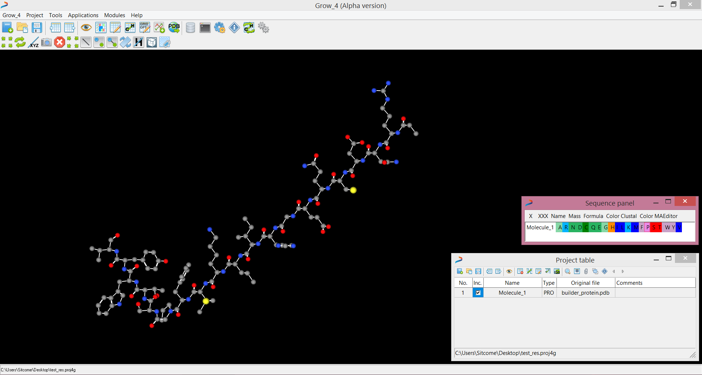

# About BioTesseract™  

The <b>BioTesseract™ </b> is an international academic initiative established as a response to still increasing demand for dedicated tools and scripts for computational biology and chemistry applications. It is free and open project supports data visualization, structural bioinformatics and next generation sequencing (NGS).

# BioTesseract™ ONE Desktop 

The <b>BioTesseract™ ONE</b> is scientific software dedicated to structural bioinfiormatics, data visualization and sequence analysis. It was created and developed by Dr Rafal Urniaz. Actually, the project was appended to the BioTesseract™ ONE and is continuously developed by the community. 

# Main features
* Small compounds, macromolecules and structure – ligand complexes visualization
* User-friendly console for high-throughput screening and easy terminal access
* Dedicated tools for data manipulation, files editing and conversion
* Specific and unique methods for data visualization

# About repository

This repository contains a source code of the <b>BioTesseract™ ONE </b>Desktop version. The software <b>was</b> distributed both, as a desktop and a web service although since the end of 2016 <b>the desktop version is no longer supported.</b>  

Last release: https://github.com/BioTesseract/ONE/releases

BioTesseract™ website: www.BioTesseract.com

## License
###### The BioTesseract™ ONE is a freeware software, distributed under the freeware license with open-access to the source code for educational purpose. The application can be used for academic users free of charge however it is strictly prohibited to assemble financial benefits of its application or its distribution by third parties. License allows distribution and modification of the results generated by program (e.g. documents, graphics and others), however, with appropriate program and author(s) indication or citation in scientific papers. To use BioTesseract™ ONE for commercial purposes we encourage donation for the BioTesseract™ project; it helps to ensure further development. Remember, downloading source code and / or compilated files you agree to the terms of the BioTesseract™ ONE license. Please note: The authors do their best to meet users’ expectations although this program and source code are distributed in the hope that it will be useful but without any warranty of its action.

BioTesseract™ ONE Desktop | Version: 1.4.1 Build: 402 | Author: Dr Rafal Urniaz et al.

